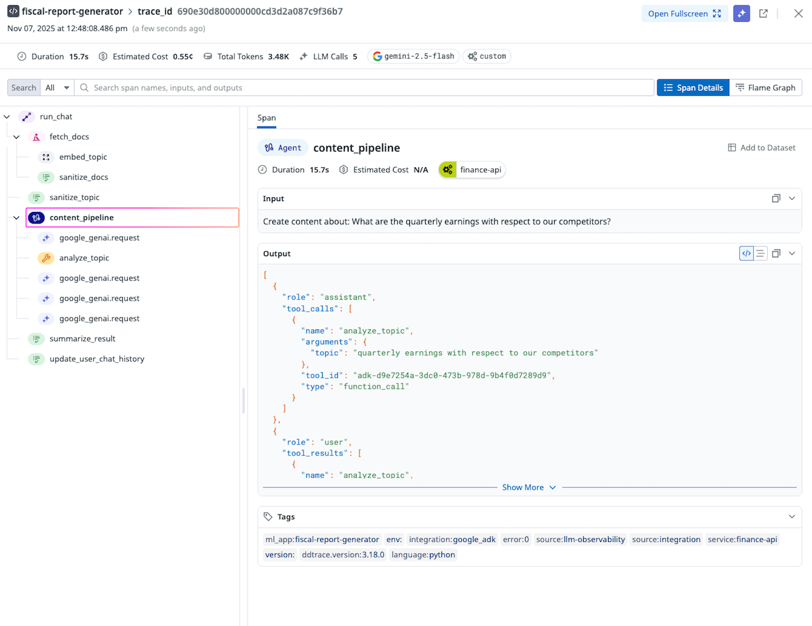

# Agent Observability with Datadog

[Datadog LLM Observability](https://www.datadoghq.com/product/llm-observability/) helps AI engineers, data scientists, and application developers quickly develop, evaluate, and monitor LLM applications. Confidently improve output quality, performance, costs, and overall risk with structured experiments, end-to-end tracing across AI agents, and evaluations.

## Overview

Datadog LLM Observability can [automatically collect traces from Google ADK leveraging auto-instrumentation](https://docs.datadoghq.com/llm_observability/instrumentation/auto_instrumentation?tab=python#google-adk), allowing you to:

- **Observe agent executions and interactions** - Automatically capture every agent run, tool call, and code execution within your agents
- **Capture LLM calls and responses** made with the underlying Google GenAI SDK
- **Debug issues** by providing error rates, token usage and cost, and out-of-the-box evaluations on your LLM calls and tool usage

## Prerequisites

Sign up for a [Datadog account](https://www.datadoghq.com/) if you do not have one and [get your API key](https://docs.datadoghq.com/account_management/api-app-keys/#api-keys).

## Installation

Install the required packages:

```bash
pip install ddtrace
```

## Setup

### Configure Environment Variables

You will also need to specify an ML Application name in the following environment variables. An ML Application is a grouping of LLM Observability traces associated with a specific LLM-based application. See [ML Application Naming Guidelines](https://docs.datadoghq.com/llm_observability/instrumentation/sdk?tab=python#application-naming-guidelines) for more information on limitations with ML Application names.

```shell
export DD_API_KEY=<YOUR_DD_API_KEY>
export DD_SITE=<YOUR_DD_SITE>
export DD_LLMOBS_ENABLED=true
export DD_LLMOBS_ML_APP=<YOUR_ML_APP_NAME>
export DD_LLMOBS_AGENTLESS_ENABLED=true
export DD_APM_TRACING_ENABLED=false  # Only set this if you are not using Datadog APM
```

Additionally, configure any LLM provider API keys

```shell
export GEMINI_API_KEY=<YOUR_GEMINI_API_KEY>
#  or
export GOOGLE_API_KEY=<YOUR_GOOGLE_API_KEY>
...
```

### Run Your Application

Once you have configured your environment variables, you can run your application and start observing your LLM-based applications.

```shell
ddtrace-run python your_application.py
```

## Observe

Navigate to the [Datadog LLM Observability Traces View](https://app.datadoghq.com/llm/traces) to see the traces generated by your application.



## Support and Resources
- [Datadog LLM Observability](https://www.datadoghq.com/product/llm-observability/)
- [Datadog Support](https://docs.datadoghq.com/help/)


